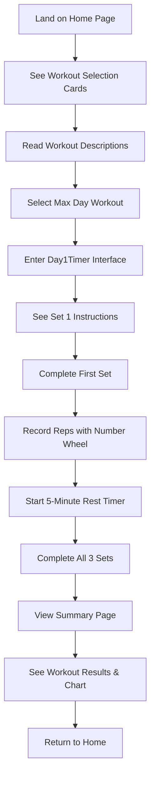
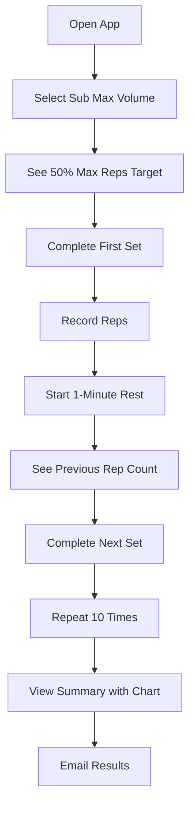
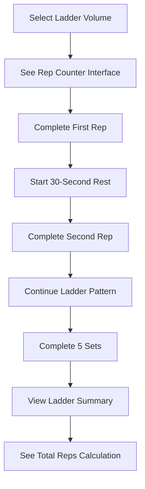

# Pullup Mastery 5.0 - UI/UX Design Document

## Table of Contents
1. [Overview](#overview)
2. [User Personas](#user-personas)
3. [User Stories](#user-stories)
4. [User Journey Maps](#user-journey-maps)
5. [Interaction Design](#interaction-design)
6. [Workout Day Flows](#workout-day-flows)
7. [Component Interactions](#component-interactions)
8. [Visual Design System](#visual-design-system)
9. [Accessibility Considerations](#accessibility-considerations)
10. [Mobile-First Design](#mobile-first-design)

## Overview

Pullup Mastery 5.0 is a specialized fitness application designed for serious pull-up training enthusiasts. The app provides three distinct workout types with intelligent timer systems, adaptive rep tracking, and comprehensive progress visualization.

### Core Value Proposition
- **Focused Training**: Three specialized workout types targeting different aspects of pull-up training
- **Intelligent Adaptation**: Dynamic rep suggestions based on previous performance
- **Uninterrupted Training**: Wake lock support and mobile-optimized interface
- **Progress Tracking**: Comprehensive data visualization and historical analysis

## User Personas

### Primary Persona: "The Dedicated Trainee"
- **Age**: 25-40
- **Experience**: Intermediate to advanced pull-up practitioner
- **Goals**: Increase max reps, build endurance, maintain consistent training
- **Pain Points**: 
  - Difficulty tracking progress across different workout types
  - Need for structured rest intervals
  - Want to see improvement over time
- **Tech Comfort**: High - comfortable with mobile apps and fitness tracking

### Secondary Persona: "The Fitness Enthusiast"
- **Age**: 20-35
- **Experience**: Beginner to intermediate
- **Goals**: Learn proper pull-up technique, build strength progressively
- **Pain Points**:
  - Unsure about proper rest intervals
  - Need guidance on rep progression
  - Want to avoid overtraining
- **Tech Comfort**: Medium - uses fitness apps but prefers simple interfaces

## User Stories

### Epic 1: Workout Selection and Initiation
**As a user, I want to easily select and start my workout so that I can begin training immediately.**

#### User Stories:
- **US1.1**: As a user, I want to see three distinct workout options clearly labeled with descriptions so I can choose the appropriate training type
- **US1.2**: As a user, I want to understand the structure of each workout (sets, rest periods) before starting so I can mentally prepare
- **US1.3**: As a user, I want to start a workout with a single tap so I can begin training without friction

### Epic 2: Workout Execution
**As a user, I want to complete my workout with proper timing and rep tracking so I can train effectively.**

#### User Stories:
- **US2.1**: As a user, I want clear visual indicators of my current set and progress so I know where I am in the workout
- **US2.2**: As a user, I want accurate timing for rest periods so I can recover properly between sets
- **US2.3**: As a user, I want to easily record my reps using an intuitive interface so I can track my performance
- **US2.4**: As a user, I want the app to suggest appropriate rep counts based on my previous performance so I can progress intelligently

### Epic 3: Progress Tracking and Analysis
**As a user, I want to see my progress and analyze my performance so I can improve over time.**

#### User Stories:
- **US3.1**: As a user, I want to see a summary of my completed workout immediately after finishing so I can review my performance
- **US3.2**: As a user, I want to edit my rep counts if I made an error so I can maintain accurate records
- **US3.3**: As a user, I want to see visual charts of my performance so I can identify trends and improvements
- **US3.4**: As a user, I want to see my total reps calculated correctly for each workout type so I can track volume

## User Journey Maps

### Journey 1: First-Time User Experience

### Journey 2: Experienced User - Sub Max Volume

### Journey 3: Ladder Volume Workout

## Interaction Design

### Core Interaction Patterns

#### 1. Number Wheel Interaction
- **Purpose**: Primary input method for recording reps
- **Interaction**: 
  - Scroll wheel for desktop
  - Touch drag for mobile
  - Keyboard arrows for accessibility
- **Visual Feedback**: 
  - 3D perspective effect
  - Color coding (green for numbers, red for "X")
  - Smooth animations

#### 2. Timer Interaction
- **Purpose**: Manage rest periods and workout timing
- **Visual Elements**:
  - Circular progress indicator
  - Large, readable time display
  - Smooth countdown animation
- **States**:
  - Active: Shows countdown with progress
  - Complete: Triggers next phase
  - Paused: Maintains state

#### 3. Set Progress Tracking
- **Purpose**: Show workout completion status
- **Visual Elements**:
  - Grid of set indicators
  - Check marks for completed sets
  - Current set highlighting
  - Rep count preview

## Workout Day Flows

### Day 1: Max Day (3 Sets, 5-Minute Rest)

#### User Flow:
1. **Workout Selection**
   - User sees "Max Day" card with description "3 sets with 5 minute rest"
   - Single tap to enter workout

2. **Set Execution Phase**
   - Display: "Max Reps" with large, prominent text
   - Action button: "Set Complete" (primary CTA)
   - Visual: Set progress indicator shows current set (1/3)

3. **Rest Phase**
   - Display: "Rest" with 5-minute countdown timer
   - Number wheel appears for rep recording
   - Wheel adapts based on previous performance
   - Visual: Circular progress timer

4. **Rep Recording**
   - User scrolls/drags number wheel to select rep count
   - "X" option for failed sets
   - Wheel range adapts to previous minimum rep count

5. **Completion**
   - After 3rd set, automatic transition to summary
   - Data saved to localStorage

#### Key Interactions:
- **Set Complete Button**: Triggers rest timer and shows number wheel
- **Number Wheel**: Records reps with adaptive range
- **Timer**: 5-minute countdown with visual progress
- **Progress Indicators**: Show set completion status

### Day 2: Sub Max Volume (10 Sets, 1-Minute Rest)

#### User Flow:
1. **Initial Display**
   - Shows "50% Max Reps" target
   - First set ready to begin

2. **Set Execution**
   - User completes set to 50% of their max
   - "Set Complete" button triggers 1-minute rest

3. **Rest and Recording**
   - 1-minute countdown timer
   - Number wheel for rep recording
   - Wheel shows previous rep count as reference

4. **Adaptive Display**
   - After first set, shows previous rep count as target
   - Wheel range adjusts to minimum of previous reps

5. **Completion**
   - After 10 sets, automatic summary
   - Total volume calculation

#### Key Interactions:
- **Adaptive Target Display**: Shows previous rep count as reference
- **Shorter Rest Periods**: 1-minute vs 5-minute for higher volume
- **Volume Focus**: Emphasis on consistent rep counts

### Day 3: Ladder Volume (5 Sets, 30-Second Rest)

#### User Flow:
1. **Ladder Interface**
   - Shows current rep number (1, 2, 3, etc.)
   - "Rep Complete" button for each individual rep

2. **Rep Execution**
   - User completes one rep
   - Clicks "Rep Complete"
   - 30-second rest timer starts

3. **Set Completion**
   - After completing reps for current set
   - "Set Complete" button appears
   - Records total reps for that set

4. **Ladder Progression**
   - Each set targets one more rep than previous
   - Visual feedback shows current rep target

5. **Summary Calculation**
   - Special calculation for ladder reps
   - Total = sum of all individual rep counts

#### Key Interactions:
- **Individual Rep Tracking**: Each rep is counted separately
- **Short Rest Periods**: 30-second intervals
- **Ladder Logic**: Progressive rep increase per set

## Component Interactions

### Number Wheel Component

#### States:
1. **Inactive**: Hidden, not shown
2. **Active**: Visible with current value selected
3. **Editing**: User interacting with wheel

#### Interactions:
- **Scroll Input**: Mouse wheel or trackpad
- **Touch Input**: Drag up/down on mobile
- **Keyboard Input**: Arrow keys for accessibility
- **Visual Feedback**: 3D perspective, color coding, smooth transitions

#### Adaptive Behavior:
- **Range Adjustment**: Min/max based on previous performance
- **X Option**: Always available for failed sets
- **Default Value**: Resets to "X" between sets

### Progress Circle Component

#### Visual Design:
- **Background Circle**: Subtle, low opacity
- **Progress Circle**: Primary color, animated
- **Time Display**: Large, centered text
- **Smooth Animation**: Linear progress updates

#### States:
- **Active**: Shows countdown with progress
- **Complete**: Triggers next action
- **Hidden**: Not displayed when not needed

### Set Progress Component

#### Visual Indicators:
- **Completed Sets**: Green background with checkmark
- **Current Set**: Primary color with rep count or arrow
- **Future Sets**: Red background with dash
- **Current Value**: Shows selected rep count during rest

#### Layout:
- **Grid Display**: Horizontal row of set indicators
- **Responsive**: Adapts to different screen sizes
- **Clear Hierarchy**: Visual distinction between states

## Visual Design System

### Color Palette
- **Primary**: Blue/teal for active elements and progress
- **Success**: Green for completed sets and positive actions
- **Destructive**: Red for failed sets and warnings
- **Muted**: Gray for inactive elements and secondary text

### Typography
- **Headers**: Large, light weight for workout titles
- **Body**: Medium weight for instructions and labels
- **Numbers**: Monospace font for rep counts and timers
- **Labels**: Small, light weight for secondary information

### Spacing and Layout
- **Mobile-First**: Optimized for phone screens
- **Landscape Support**: Adapts to horizontal orientation
- **Consistent Spacing**: 4px grid system
- **Touch Targets**: Minimum 44px for interactive elements

### Visual Hierarchy
- **Primary Actions**: Large, prominent buttons
- **Secondary Actions**: Smaller, less prominent
- **Information**: Clear, readable text hierarchy
- **Progress**: Visual indicators for status

## Accessibility Considerations

### Keyboard Navigation
- **Tab Order**: Logical flow through interactive elements
- **Arrow Keys**: Number wheel navigation
- **Enter/Space**: Button activation
- **Escape**: Cancel or go back

### Screen Reader Support
- **ARIA Labels**: Descriptive labels for all interactive elements
- **Role Attributes**: Proper semantic roles
- **Live Regions**: Updates for dynamic content
- **Alt Text**: Descriptive text for visual elements

### Visual Accessibility
- **High Contrast**: Sufficient color contrast ratios
- **Large Text**: Readable font sizes
- **Focus Indicators**: Clear focus states
- **Color Independence**: Information not conveyed by color alone

### Motor Accessibility
- **Large Touch Targets**: Easy to tap on mobile
- **Drag Interactions**: Alternative to precise tapping
- **Error Prevention**: Confirmation for destructive actions
- **Undo Capability**: Ability to correct mistakes

## Mobile-First Design

### Responsive Breakpoints
- **Mobile**: 320px - 768px (primary focus)
- **Tablet**: 768px - 1024px
- **Desktop**: 1024px+ (secondary)

### Touch Interactions
- **Swipe Gestures**: Number wheel scrolling
- **Tap Targets**: Minimum 44px touch areas
- **Haptic Feedback**: Vibration for interactions (where supported)
- **Orientation Support**: Landscape and portrait modes

### Performance Considerations
- **Fast Loading**: Optimized for mobile networks
- **Smooth Animations**: 60fps target for interactions
- **Battery Optimization**: Efficient timer implementations
- **Wake Lock**: Prevents screen sleep during workouts

### Mobile-Specific Features
- **Full Screen**: Immersive workout experience
- **Portrait Lock**: Optional orientation lock
- **Notification Support**: Workout reminders and alerts
- **Offline Capability**: Works without internet connection

## Conclusion

This design document outlines a comprehensive user experience for Pullup Mastery 5.0, focusing on the three distinct workout types and their specific interaction patterns. The design prioritizes mobile-first interactions while maintaining accessibility and usability across all devices. The adaptive nature of the rep tracking system and the clear visual hierarchy ensure users can focus on their training while maintaining accurate progress records.

The modular component design allows for easy maintenance and future enhancements while providing a consistent and intuitive user experience across all workout types.
